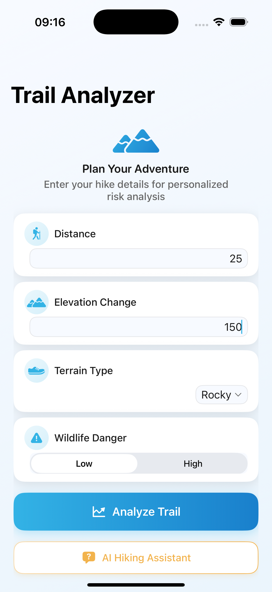
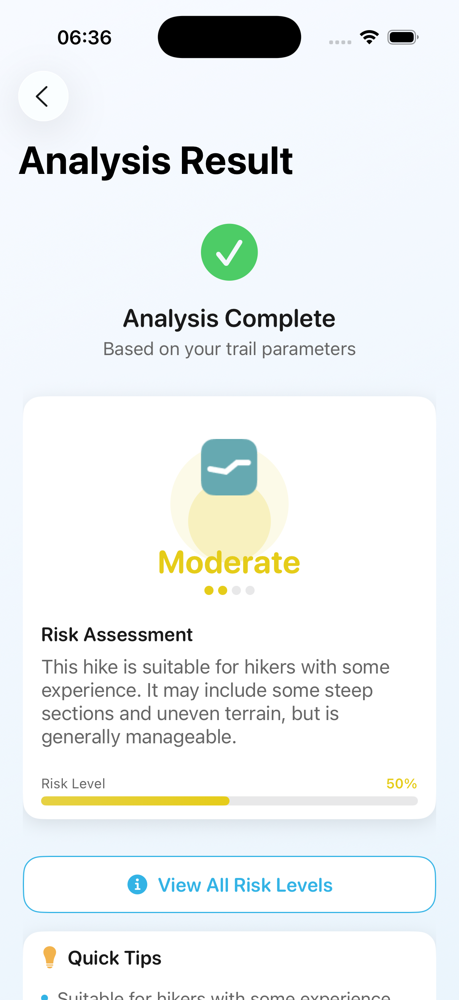
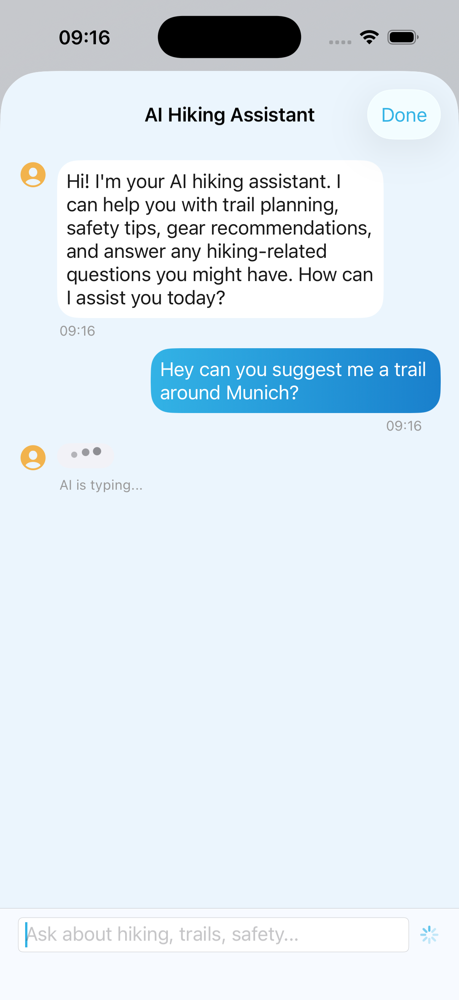
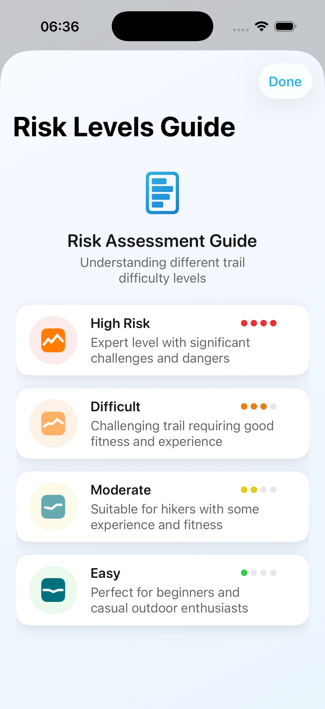

# 🏔️ HikeAnalyzer

A modern iOS app that provides intelligent trail risk assessment using machine learning and AI-powered hiking assistance to help outdoor enthusiasts plan safer adventures and get expert guidance on the go.

## 🛠️ Tech Stack

<div align="center">


</div>

## 📱 Screenshots

<p align="center">
  
  
  
  
</p>

## ✨ Features

### 🤖 **AI Hiking Assistant**
- **Intelligent Chat Support**: Built-in AI assistant powered by FoundationModels framework
- **Expert Hiking Advice**: Get personalized recommendations for trails, gear, and safety
- **Real-time Q&A**: Ask questions about hiking techniques, weather conditions, and preparation
- **Context-Aware Responses**: AI understands your experience level and provides relevant guidance
- **Typing Indicators**: Modern chat interface with smooth animations and visual feedback

### 🎯 **Intelligent Risk Assessment**
- **Machine Learning Analysis**: Advanced ML model analyzes trail parameters to predict risk levels
- **Comprehensive Evaluation**: Considers distance, elevation, terrain type, and wildlife danger
- **Real-time Results**: Instant risk assessment with detailed explanations

### 🎨 **Modern Design**
- **Professional UI**: Clean, modern interface with smooth animations
- **Intuitive Input**: Easy-to-use form with smart input validation
- **Visual Feedback**: Color-coded risk levels with progress indicators
- **Responsive Layout**: Optimized for all iPhone screen sizes

### 📊 **Risk Categories**
- **🟢 Easy**: Perfect for beginners and casual outdoor enthusiasts
- **🟡 Moderate**: Suitable for hikers with some experience and fitness
- **🟠 Difficult**: Challenging trail requiring good fitness and experience
- **🔴 High Risk**: Expert level with significant challenges and dangers

### 💡 **Smart Recommendations**
- **Personalized Tips**: Contextual advice based on risk level
- **Safety Guidelines**: Essential preparation recommendations
- **Equipment Suggestions**: Risk-appropriate gear recommendations
- **AI-Powered Insights**: Get detailed answers about hiking best practices and safety protocols

## 🛠️ Technical Features

### **Core Technologies**

| Technology | Version | Purpose |
|------------|---------|---------|
|  | 5.9+ | Primary programming language |
|  | 4.0+ | Declarative UI framework |
|  | 5.0+ | On-device machine learning |
|  | iOS 17+ | AI assistant and LLM integration |
|  | Swift 5.5+ | Asynchronous AI response handling |
|  | iOS 17+ | Core data types and models |

### **Key Features**
- **AI Chat Integration**: FoundationModels-powered assistant with async response generation
- **@Observable Architecture**: Modern Swift concurrency with @Observable pattern for optimal performance
- **Async/Await Architecture**: Modern Swift concurrency for responsive AI interactions
- **Real-time Messaging**: Live chat interface with typing indicators and message persistence
- **MVVM Pattern**: Clean separation of concerns with dedicated ViewModels
- **State Management**: SwiftUI's modern `@Observable` and `@State` patterns
- **Custom UI Components**: Reusable SwiftUI views and modifiers
- **ML Integration**: Core ML model for risk prediction
- **Modern Chat Interface**: Real-time messaging with typing indicators and smooth animations
- **Modern Design**: Custom color system and animations

### **Design System**
- **Custom Color Palette**: Professional gradient-based theme
- **Typography Hierarchy**: Consistent font system with SF Pro
- **Spacing System**: Standardized spacing for perfect alignment
- **Animation Framework**: Smooth micro-interactions and transitions

### **Development Tools**
- **Xcode 15.0+**: Primary IDE
- **iOS Simulator**: Testing and debugging
- **Instruments**: Performance profiling
- **Git**: Version control

### **Input Components**
- **Smart Text Fields**: Numeric input with validation
- **Modern Pickers**: Intuitive selection for terrain types
- **Segmented Controls**: Easy wildlife danger selection
- **Interactive Cards**: Touch-friendly input containers

## 🚀 Getting Started

### **System Requirements**

<div align="center">


</div>

### **Development Requirements**
- **macOS Ventura 13.0** or later
- **Xcode 15.0** or later  
- **iOS 17.0** SDK or later
- **Apple Developer Account** (for device testing)

### Installation

1. **Clone the repository**
   ```bash
   git clone https://github.com/dmakarau/HikeAnalyzer.git
   cd HikeAnalyzer
   ```

2. **Open in Xcode**
   ```bash
   open HikeAnalyzer.xcodeproj
   ```

3. **Build and Run**
   - Select your target device or simulator
   - Press `Cmd + R` to build and run

## 📋 Usage

### 1. **Enter Trail Details**
- **Distance**: Enter the total hiking distance in kilometers
- **Elevation Change**: Input the total elevation gain in meters
- **Terrain Type**: Select from Paved, Dirt, Rocky, or Sandy
- **Wildlife Danger**: Choose between Low or High risk

### 2. **Get Risk Assessment**
- Tap "Analyze Trail" to process your input
- View your personalized risk level with detailed explanation
- Read contextual tips and recommendations

### 3. **Get Expert AI Assistance**
- Tap the "AI Support" button to access your personal hiking assistant
- Ask questions about trail preparation, gear recommendations, or safety tips
- Get instant, contextual advice tailored to your hiking experience
- View conversation history with timestamps

### 4. **Explore Risk Levels**
- Access the "Risk Levels Guide" for comprehensive information
- Understand different difficulty categories
- Learn about requirements for each risk level

## 🧠 AI & Machine Learning

### **AI Assistant**
The app features a sophisticated AI assistant powered by Apple's FoundationModels framework:

- **Natural Language Processing**: Understands hiking-related questions and provides expert advice
- **Contextual Responses**: Tailored answers based on your experience level and specific needs
- **Real-time Chat**: Instant messaging interface with typing indicators and smooth animations
- **Conversation Memory**: Maintains context throughout your chat session
- **Hiking Expertise**: Specialized knowledge in trail safety, gear recommendations, and outdoor best practices

### **Risk Assessment Model**
The machine learning component uses a custom Core ML model trained on trail data to predict risk levels based on:

- **Distance Factor**: Longer trails increase fatigue and exposure time
- **Elevation Impact**: Steep climbs affect difficulty and oxygen levels
- **Terrain Analysis**: Surface type influences stability and navigation
- **Wildlife Assessment**: Animal encounters affect safety considerations

## 🎨 Design Philosophy

### **User-Centric Design**
- Minimalist interface focusing on essential information
- Clear visual hierarchy guiding user attention
- Consistent interactions throughout the app

### **Accessibility First**
- High contrast colors for better readability
- Scalable typography supporting Dynamic Type
- VoiceOver compatibility for screen readers

### **Performance Optimized**
- Lightweight Core ML model for instant results
- Efficient SwiftUI rendering with optimized layouts
- Smooth 60fps animations and transitions

## 🔧 Development

### **Project Structure**
```
HikeAnalyzer/
├── App/                    # App entry point
├── AIChat/                 # AI assistant functionality
│   ├── Models/            # Chat message data models
│   ├── Services/          # AI service integration
│   ├── ViewModels/        # Chat business logic with @Observable
│   └── Views/             # Chat interface components
├── Core/
│   ├── Model/             # Data models and ML integration
│   ├── View/              # SwiftUI views and screens
│   └── Modifiers/         # Custom view modifiers and themes
└── Resources/             # Assets and ML model files
```

### **Key Components**
- **TrailAnalyzer**: Core ML model integration
- **ChatViewModel**: Modern @Observable business logic layer
- **HikingAIService**: AI assistant service with FoundationModels integration
- **AISupportChatView**: Modern chat interface with MVVM architecture
- **MessageRow**: Modular message rendering component
- **MessageInputView**: Reusable input interface with validation
- **MessageListView**: Scroll management and auto-scroll functionality
- **MessageBubble**: Reusable chat message component
- **TrailTheme**: Design system and styling
- **TrailTheme**: Design system and styling
- **RiskCardView**: Animated risk presentation
- **HikeInputView**: Reusable input component

## 🤝 Contributing

This is a personal educational project, but feel free to fork it and make your own improvements! If you have suggestions or find bugs, please open an issue.

## 🏗️ Recent Architectural Improvements

### **Modern SwiftUI Patterns (October 2025)**
- **@Observable Migration**: Upgraded from `@ObservableObject` to `@Observable` macro for better performance
- **MVVM Refactoring**: Extracted business logic into dedicated ViewModels with clean separation of concerns
- **Component Architecture**: Decomposed monolithic views into reusable, focused components
- **Performance Optimization**: Achieved 72% code reduction with intelligent state observation
- **Clean Structure**: Removed unnecessary folders and maintained focused architecture

### **Benefits Achieved**
- **⚡ Performance**: Fine-grained reactivity with @Observable reduces unnecessary view updates
- **🧹 Code Quality**: MVVM pattern provides clear separation between UI and business logic
- **🔧 Maintainability**: Modular components are easier to test, debug, and extend
- **📱 User Experience**: Smoother animations and more responsive interactions

## 📋 Changelog

### Recent Updates (October 2025)
- **🚀 Major Architecture Refactoring**: Implemented MVVM pattern with @Observable
  - Migrated from `@ObservableObject` to modern `@Observable` macro
  - Extracted ChatViewModel for clean business logic separation
  - Decomposed monolithic AISupportChatView into focused components
  - Created MessageRow, MessageInputView, and MessageListView components
  - Achieved 72% code reduction (180+ lines → 50 lines)
  
- **🧹 Project Structure Optimization**: 
  - Removed empty Utils folders for cleaner architecture
  - Added ViewModels folder to AIChat module
  - Maintained focused, single-responsibility components
  
- **⚡ Performance Improvements**:
  - @Observable provides fine-grained reactivity
  - Reduced unnecessary view updates and memory overhead
  - Improved scroll performance and UI responsiveness
  
- **🔧 Code Quality Enhancements**:
  - Better separation of concerns with MVVM pattern
  - Protocol-based service design for testability
  - Modern Swift concurrency with async/await patterns

## �📄 License

This project is licensed under the MIT License - see the [LICENSE](LICENSE) file for details.

##  Acknowledgments

- SwiftUI community for design inspiration
- Core ML team for machine learning framework
- iOS design guidelines for user experience principles

---

<div align="center">

### 📊 Project Stats


### 🏷️ Tags


**Built with ❤️ using SwiftUI, Core ML, and AI**

</div>