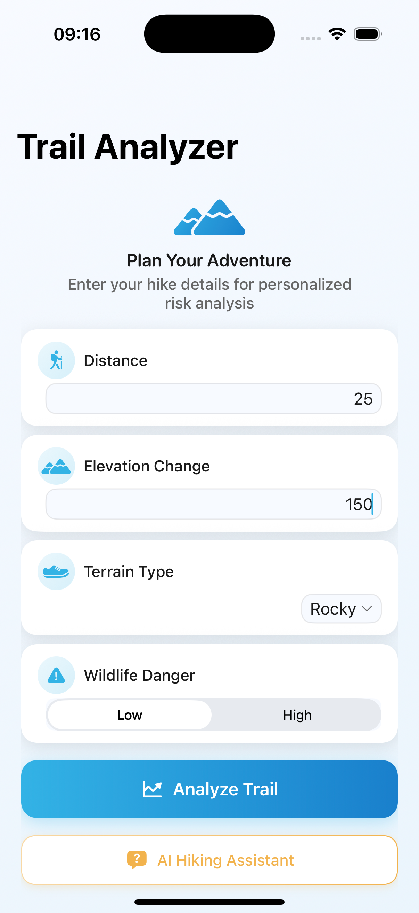
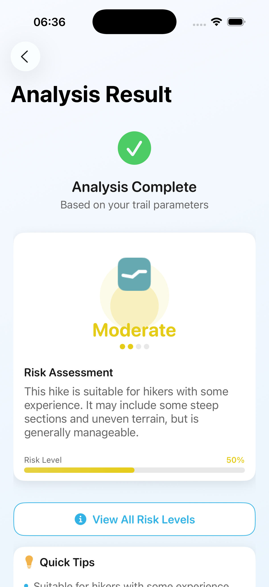
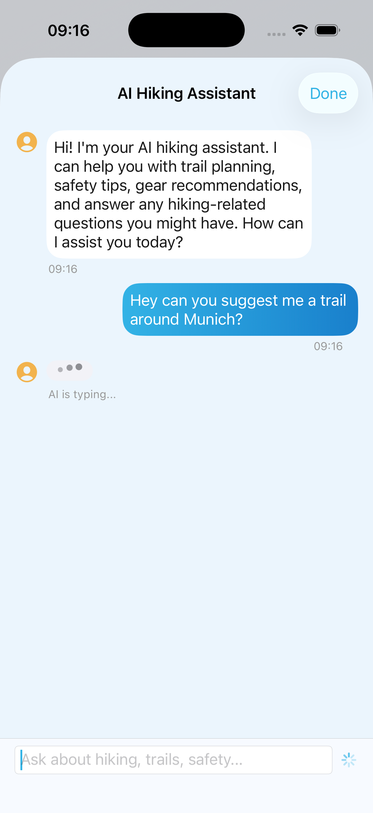
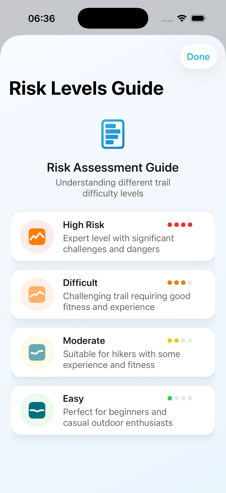

# HikeAnalyzer

An iOS app for trail risk assessment. Uses Core ML for predictions and an on-device AI agent for hiking advice — showcasing iOS 26 FoundationModels tool calling and structured output.

## Tech Stack

<div align="center">


</div>

## Screenshots

<p align="center">
  
  
  
  
</p>

## Features

### AI Agent with Tool Calling (iOS 26+)
The chat assistant is a genuine AI agent — not just a chatbot. When you describe a trail, the on-device language model autonomously calls the CoreML risk model as a **tool**, then generates a structured `@Generable` report rendered as a rich UI card.

- Describe a trail in natural language and the AI calls CoreML on your behalf
- Structured output via `@Generable` — typed Swift structs, not string parsing
- Report card with risk level, hazards, gear checklist, and numbered safety steps
- Persistent `LanguageModelSession` across messages for full conversation context
- General questions return plain conversational text — the agent decides when to analyze

### Trail Risk Assessment
- Core ML model predicts trail difficulty from distance, elevation, terrain, and wildlife
- AI-enhanced explanations and personalized recommendations (iOS 26+)
- Four risk levels: Easy, Moderate, Difficult, High Risk

## How to Test the AI Agent

Open the AI Hiking Assistant and try these:

**Triggers a structured report card:**
> "Analyze a 12km rocky trail with 900m elevation gain and high wildlife danger"

**Tests follow-up with persistent context:**
> "What if I lower the elevation to 400m?"

**Returns plain conversational text (no card):**
> "What should I eat before a long hike?"

## Getting Started

### Requirements
- Xcode 16.0+
- iOS 26.0+ device or simulator
- Apple Intelligence enabled for full FoundationModels support

### Installation

1. **Clone the repository**
   ```bash
   git clone https://github.com/dmakarau/HikeAnalyzer.git
   cd HikeAnalyzer
   ```

2. **Open in Xcode**
   ```bash
   open HikeAnalyzer.xcodeproj
   ```

3. **Build and Run** — `Cmd + R`

## Architecture

MVVM with `@Observable` + `@MainActor`. Two feature modules: `Core` (trail analysis) and `AIChat` (agent chat).

```
HikeAnalyzer/
├── Core/
│   ├── Model/             # Risk, TrailInfo, IntelligentRiskAnalyzer
│   ├── Services/          # CoreMLTrailAnalyzer, FeatureFlags
│   ├── View/              # Trail input and results screens
│   ├── ViewModels/        # TrailInputViewModel, TrailAnalysisViewModel
│   └── Modifiers/         # TrailTheme (design system)
└── AIChat/
    ├── Models/            # ChatMessage, TrailAnalysisReport (@Generable)
    ├── Services/          # HikingAIService, TrailAnalyzerTool (Tool)
    ├── ViewModels/        # ChatViewModel
    └── Views/             # Chat UI, TrailReportCardView
```

### Key iOS 26 APIs used
- **`Tool` protocol** — `TrailAnalyzerTool` wraps `CoreMLTrailAnalyzer` so the language model can invoke CoreML as a function
- **`@Generable` / `@Guide`** — `TrailAnalysisReport` is a typed Swift struct the model fills directly, no string parsing
- **`LanguageModelSession`** — persistent session with tool registration and `respond(to:generating:)` for structured output
- **`SystemLanguageModel`** — fully on-device, no network, no API keys

## Changelog

### April 2026
- AI agent: FoundationModels tool calling with CoreML as an invokable tool
- Structured output via `@Generable` — `TrailAnalysisReport` with hazards, gear, and safety steps
- `TrailReportCardView` — rich card rendered in chat for trail-specific queries
- Persistent `LanguageModelSession` for conversation context across messages

### December 2025
- Apple Intelligence integration via FoundationModels (iOS 26+)
- AI-enhanced risk explanations and recommendations
- Fallback for devices without FoundationModels support

### Earlier
- MVVM refactoring with `@Observable`
- Core ML trail risk model
- AI chat assistant

## License

MIT License — see [LICENSE](LICENSE).

---

Built with SwiftUI, Core ML, and FoundationModels.
